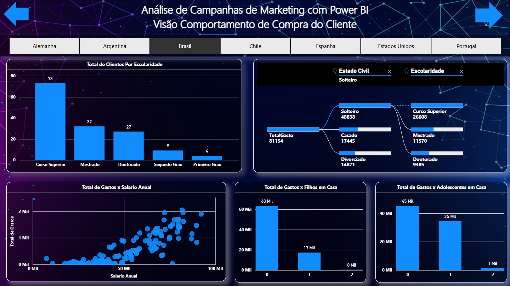

# 📢 Dashboard de Marketing e Comportamento de Compra

Este projeto de Business Intelligence foi desenvolvido com base nos cursos da **Data Science Academy (DSA)**, com foco em compreender o perfil e o comportamento dos clientes em campanhas de marketing, a partir de filtros como escolaridade, estado civil, filhos em casa e país.

> ⚠️ Os dados utilizados neste projeto são didáticos e fornecidos exclusivamente no curso da DSA. Não estão incluídos neste repositório por questões de licenciamento. Veja mais detalhes abaixo.

---

## 🎯 Objetivos do Projeto

- Entender o comportamento de compra dos clientes com base em escolaridade, estado civil e composição familiar
- Analisar os gastos totais em relação ao salário anual
- Avaliar o impacto de filhos ou adolescentes em casa nos gastos do consumidor
- Explorar a segmentação por país para estratégias regionais de marketing

---

## 🖼️ Visual do Dashboard

### Componentes:

- 📊 **Total de Clientes por Escolaridade**: identifica o perfil educacional predominante na base de clientes.
- 🔁 **Fluxo entre Estado Civil e Escolaridade**: exibe o relacionamento entre variáveis demográficas com base no volume de gastos.
- 💸 **Total de Gastos vs Salário Anual**: análise de correlação entre renda e comportamento de consumo.
- 👨‍👩‍👦 **Total de Gastos vs Filhos em Casa**: revela padrões de gastos conforme a quantidade de filhos.
- 👨‍🎓 **Total de Gastos vs Adolescentes em Casa**: mostra o impacto da presença de adolescentes no consumo.
- 🌍 **Segmentação por País**: interatividade para analisar os dados por região (Brasil, Chile, Portugal, etc.).

---

## 🧰 Ferramentas Utilizadas

- Power BI Desktop
- Power Query (tratamento de dados)
- DAX (métricas e segmentações)
- Visuais como gráfico de barras, diagrama de fluxo (sankey), dispersão e treemap

---

## 🗂️ Filtros disponíveis

- País (Alemanha, Argentina, Brasil, Chile, Espanha, EUA, Portugal)
- Estado Civil
- Escolaridade

---

## ⚠️ Sobre os Dados

Os dados utilizados neste projeto são educacionais e foram fornecidos no curso da DSA "Microsoft Power BI para Business Intelligence e Data Science".

Por respeito aos direitos autorais, **os arquivos originais de dados não estão incluídos neste repositório**.

Você pode acessá-los gratuitamente ao se inscrever no curso oficial da DSA:  
🔗 [https://www.datascienceacademy.com.br](https://www.datascienceacademy.com.br)

---

## 👨‍💻 Autor

**Lucas Silva**  
[LinkedIn](https://www.linkedin.com/in/seu-usuario/)  
📧 seuemail@exemplo.com

---

