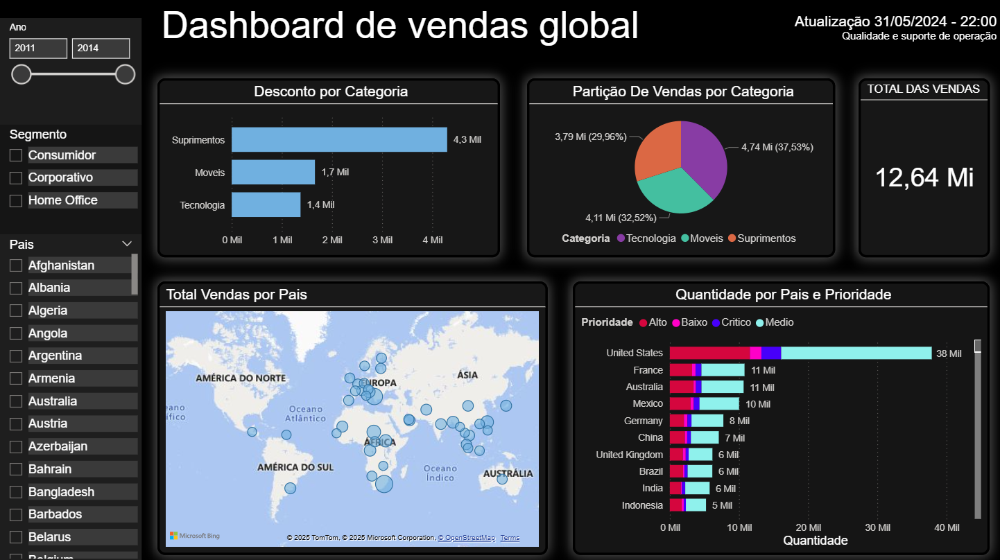

# 🌍 Dashboard de Vendas Global

Este projeto de Business Intelligence foi desenvolvido com base no treinamento da **Data Science Academy (DSA)**. O objetivo foi construir um **dashboard interativo e responsivo em Power BI** para visualizar e explorar dados de vendas globais por país, categoria de produto, prioridade e segmento.

> 📌 Este projeto utiliza dados fornecidos exclusivamente para fins educacionais no curso da DSA. Os dados não estão incluídos neste repositório por questões de licenciamento. Veja o aviso ao final.

---

## 🎯 Objetivos do Projeto

- Analisar o desempenho global de vendas entre 2011 e 2014
- Identificar os países com maior volume de vendas
- Avaliar a distribuição de vendas por categorias de produto e prioridade
- Explorar padrões por segmento (Consumo, Corporativo e Home Office)
- Fornecer uma visão geográfica das operações por meio de mapa interativo

---

## 🖼️ Visão do Dashboard

### Componentes:

- 📊 **Desconto por Categoria**: análise dos valores de desconto concedidos por segmento.
- 🥧 **Partição de Vendas por Categoria**: proporção percentual entre Suprimentos, Móveis e Tecnologia.
- 💰 **Indicador de Total de Vendas**: destaque do valor agregado no período filtrado.
- 🗺️ **Total de Vendas por País**: visualização geográfica com bolhas proporcionais ao volume de vendas.
- 📊 **Quantidade por País e Prioridade**: análise por criticidade (Alto, Baixo, Crítico, Médio).

---

## ⚙️ Funcionalidades

- Filtros interativos por **Ano**, **Segmento** e **País**
- Atualização automática com **data e hora** no cabeçalho
- Layout com **tema escuro (dark mode)** e painéis destacados
- Mapa dinâmico via **Microsoft Bing / OpenStreetMap**

---

## 🧰 Ferramentas Utilizadas

- **Power BI Desktop**
- Power Query para ETL
- DAX para cálculos e métricas
- Visualizações nativas e mapa integrado

---

## 🚫 Aviso sobre os Dados

Os dados utilizados neste projeto foram disponibilizados no curso gratuito de Power BI da Data Science Academy e são de uso exclusivamente educacional.  
**Não estão incluídos neste repositório** por respeito aos termos de uso da plataforma.

Caso queira utilizar os dados, você pode se inscrever gratuitamente no curso através do site:  
🔗 [https://www.datascienceacademy.com.br](https://www.datascienceacademy.com.br)

---

## 👨‍💻 Autor

**Lucas Silva**  
[LinkedIn](https://www.linkedin.com/in/lucas-rsilva0/)  
Email: lucca01silva@gmail.com

---

